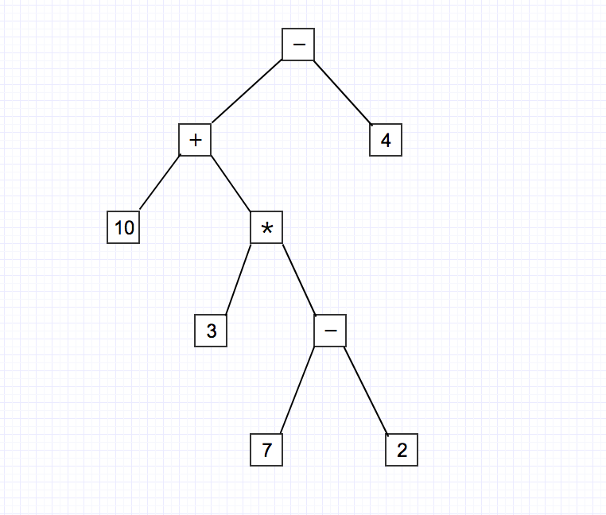

## 什么是 AST？

AST，它的全名是 abstract syntax tree(抽象语法树)

抽象语法树，其实就是使用树状结构表示源代码的语法结构，树的每一个节点就代表源代码中的一个结构。

例如，表达式 10+3\*(7-2)-4

抽象语法树为：



## Go 的 AST 内部是如何组织的？

我们知道，根据编译过程，一般来说首先我们需要词法分析，然后才有语法分析。
Go 的 parser 接受的输入是源文件, 内嵌了一个 scanner,最后把 scanner 生成的
token 变成一颗抽象语法树(AST)。

## 语法树的生成过程

`fset := token.NewFileSet()`

新建一个 AST 文件集合，

```go
// A FileSet represents a set of source files.
// Methods of file sets are synchronized; multiple goroutines
// may invoke them concurrently.
//
type FileSet struct {
	mutex sync.RWMutex // 加锁保护
	base int // 基准偏移
	files []*File // 按顺序被加入的文件集合
	last *File // 最后一个文件缓存
}

```

然后，解析该集合，`f, err := parser.ParseFile(fset, "", src, 0)`

ParseFile 会解析单个 Go 源文件的源代码并返回相应的 ast.File 节点。
源代码可以通过传入源文件的文件名，或 src 参数提供。如果 src！= nil，
则 ParseFile 将从 src 中解析源代码，文件名为仅在记录位置信息时使用。

```go
func ParseFile(fset *token.FileSet, filename string, src interface{}, mode Mode) (f *ast.File, err error) {
  	if fset == nil {
  		panic("parser.ParseFile: no token.FileSet provided (fset == nil)")
  	}

  	// 读取源文件，返回[]byte类型数据
  	text, err := readSource(filename, src)
  	if err != nil {
  		return nil, err
  	}

  	var p parser
  	defer func() {
  		if e := recover(); e != nil {
  			// resume same panic if it's not a bailout
  			if _, ok := e.(bailout); !ok {
  				panic(e)
  			}
  		}

  		// set result values
  		if f == nil {
  			// source is not a valid Go source file - satisfy
  			// ParseFile API and return a valid (but) empty
  			// *ast.File
  			f = &ast.File{
  				Name:  new(ast.Ident),
  				Scope: ast.NewScope(nil),
  			}
  		}

  		p.errors.Sort()
  		err = p.errors.Err()
  	}()

  	// 解析文件
    // 初始化解析器
  	p.init(fset, filename, text, mode)
    // 解析器解析文件
  	f = p.parseFile()

  	return
  }

```

```go
// parser 结构体是解析器的核心
  type parser struct {
  	file    *token.File
  	errors  scanner.ErrorList
  	scanner scanner.Scanner

  	// 追踪和问题排查
  	mode   Mode // 解析模式
  	trace  bool // == (mode & Trace != 0)
  	indent int  // 跟踪输出的缩进

  	// Comments
  	comments    []*ast.CommentGroup
  	leadComment *ast.CommentGroup
  	lineComment *ast.CommentGroup

  	// 定义下一个标识
  	pos token.Pos
  	tok token.Token
  	lit string

  	// 错误恢复
  	syncPos token.Pos
  	syncCnt int

  	// 非句法解析器控制
  	exprLev int
  	inRhs   bool

  	// 普通标识符范围
  	pkgScope   *ast.Scope
  	topScope   *ast.Scope
  	unresolved []*ast.Ident
  	imports    []*ast.ImportSpec

  	// 标签范围
  	labelScope  *ast.Scope
  	targetStack [][]*ast.Ident
  }


```

具体的解析过程:

```go
func (p *parser) parseFile() *ast.File {
    // 追踪模式
  	if p.trace {
  		defer un(trace(p, "File"))
  	}

    // 如果我们扫描第一个令牌时出现错误，不影响其他的解析
  	if p.errors.Len() != 0 {
  		return nil
  	}

  	// package的条款
  	doc := p.leadComment
  	pos := p.expect(token.PACKAGE)

  	ident := p.parseIdent()
  	if ident.Name == "_" && p.mode&DeclarationErrors != 0 {
  		p.error(p.pos, "invalid package name _")
  	}
  	p.expectSemi()


  	if p.errors.Len() != 0 {
  		return nil
  	}

  	p.openScope()
    // 作用域
  	p.pkgScope = p.topScope
    // 声明的node集合
  	var decls []ast.Decl
  	if p.mode&PackageClauseOnly == 0 {
  		// import decls
  		for p.tok == token.IMPORT {
  			decls = append(decls, p.parseGenDecl(token.IMPORT, p.parseImportSpec))
  		}

  		if p.mode&ImportsOnly == 0 {
  			// 其余的包装体
  			for p.tok != token.EOF {
  				decls = append(decls, p.parseDecl(syncDecl))
  			}
  		}
  	}
  	p.closeScope()
  	assert(p.topScope == nil, "unbalanced scopes")
  	assert(p.labelScope == nil, "unbalanced label scopes")

  	// 解析同一文件中的全局标识符
  	i := 0
  	for _, ident := range p.unresolved {
  		assert(ident.Obj == unresolved, "object already resolved")
  		ident.Obj = p.pkgScope.Lookup(ident.Name) // also removes unresolved sentinel
  		if ident.Obj == nil {
  			p.unresolved[i] = ident
  			i++
  		}
  	}
    // 构造AST文件
  	return &ast.File{
  		Doc:        doc,
  		Package:    pos,
  		Name:       ident,
  		Decls:      decls,
  		Scope:      p.pkgScope,
  		Imports:    p.imports,
  		Unresolved: p.unresolved[0:i],
  		Comments:   p.comments,
  	}
  }

```

AST 的每种类型结构:

```go
// 所有的AST树的节点都需要实现Node接口
  type Node interface {
  	Pos() token.Pos // position of first character belonging to the node
  	End() token.Pos // position of first character immediately after the node
  }

  // 所有的表达式都需要实现Expr接口
  type Expr interface {
  	Node
  	exprNode()
  }

  // 所有的语句都需要实现Stmt接口
  type Stmt interface {
  	Node
  	stmtNode()
  }

  // 所有的声明都需要实现Decl接口
  type Decl interface {
  	Node
  	declNode()
  }

```

上面就是语法的三个主体,表达式(expression),语句(statement)和声明(declaration),
Node 是基类接口,任何类型的主体都是 Node，用于标记该节点位置的开始和结束.

不过三个主体的函数没有实际意义,只是用三个 interface 来区分不同的语法单位,
如果某个语法是 Stmt 的话,就实现一个空的 stmtNode 函数即可.

这样的好处是可以对语法单元进行 comma,ok 来判断类型,并且保证只有这些变量可以赋值给对应的 interface.
但是实际上这个划分不是很严格

## 整个内容详情:

`1.普通 Node,不是特定语法结构,属于某个语法结构的一部分.`

Comment 表示一行注释 // 或者 / /
CommentGroup 表示多行注释
Field 表示结构体中的一个定义或者变量,或者函数签名当中的参数或者返回值
FieldList 表示以”{}”或者”()”包围的 Filed 列表

`2.Expression & Types (都划分成 Expr 接口)`

- BadExpr 用来表示错误表达式的占位符
- Ident 比如报名,函数名,变量名
- Ellipsis 省略号表达式,比如参数列表的最后一个可以写成 arg...
- BasicLit 基本字面值,数字或者字符串
- FuncLit 函数定义
- CompositeLit 构造类型,比如{1,2,3,4}
- ParenExpr 括号表达式,被括号包裹的表达式
- SelectorExpr 选择结构,类似于 a.b 的结构
- IndexExpr 下标结构,类似这样的结构 expr[expr]
- SliceExpr 切片表达式,类似这样 expr[low:mid:high]
- TypeAssertExpr 类型断言类似于 X.(type)
- CallExpr 调用类型,类似于 expr()
- StarExpr 表达式,类似于 X
- UnaryExpr 一元表达式
- BinaryExpr 二元表达式
- KeyValueExp 键值表达式 key:value
- ArrayType 数组类型
- StructType 结构体类型
- FuncType 函数类型
- InterfaceType 接口类型
- MapType map 类型
- ChanType 管道类型

`3.Statements`

- BadStmt 错误的语句
- DeclStmt 在语句列表里的申明
- EmptyStmt 空语句
- LabeledStmt 标签语句类似于 indent:stmt
- ExprStmt 包含单独的表达式语句
- SendStmt chan 发送语句
- IncDecStmt 自增或者自减语句
- AssignStmt 赋值语句
- GoStmt Go 语句
- DeferStmt 延迟语句
- ReturnStmt return 语句
- BranchStmt 分支语句 例如 break continue
- BlockStmt 块语句 {} 包裹
- IfStmt If 语句
- CaseClause case 语句
- SwitchStmt switch 语句
- TypeSwitchStmt 类型 switch 语句 switch x:=y.(type)
- CommClause 发送或者接受的 case 语句,类似于 case x <-:
- SelectStmt select 语句
- ForStmt for 语句
- RangeStmt range 语句

`4.Declarations`

- Spec type

- Import Spec

- Value Spec

- Type Spec

- BadDecl 错误申明

- GenDecl 一般申明(和 Spec 相关,比如 import “a”,var a,type a)

- FuncDecl 函数申明

`5.Files and Packages`

File 代表一个源文件节点,包含了顶级元素.

Package 代表一个包,包含了很多文件.

> 有人还专门给 Go 的语法树做了个可视化：yuroyoro/goast-viewer，会对语法树更加清晰。
