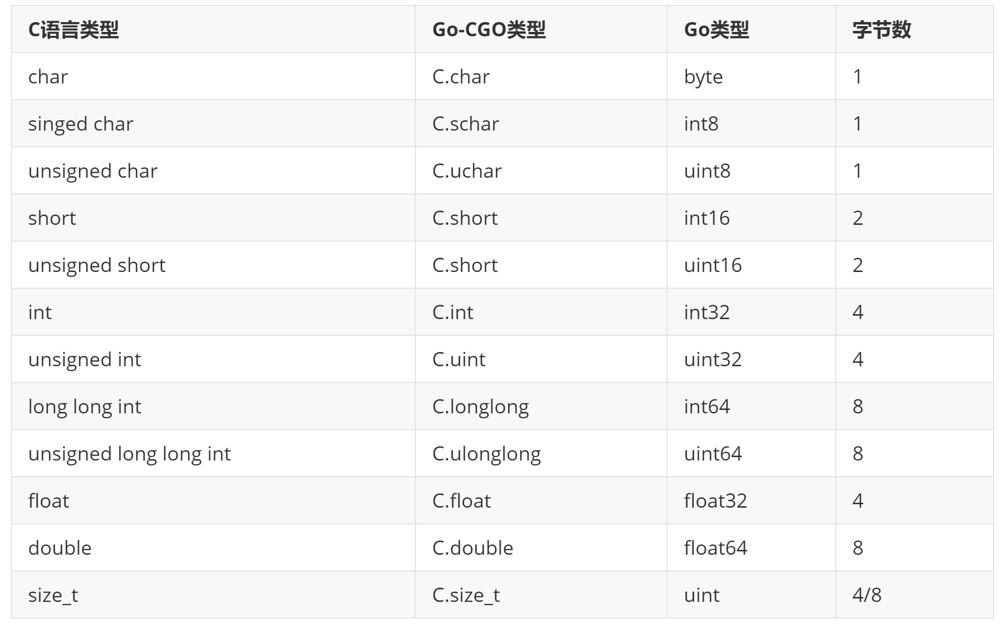
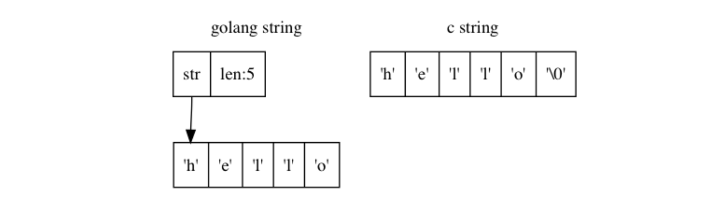

# 数值类型



# 切片
Go 中切片的使用方法类似 C 中的数组，但是内存结构并不一样。C 中的数组实际上指的是一段连续的内存，而 Go 的切片在存储数据的连续内存基础上，还有一个头结构体，其内存结构如下:


因此 Go 的切片不能直接传递给 C 使用，而是需要取切片的内部缓冲区的首地址(即首个元素的地址)来传递给 C 使用。使用这种方式把 Go 的内存空间暴露给 C 使用，可以大大减少 Go 和 C 之间参数传递时内存拷贝的消耗。

# 字符串
Go 的字符串与 C 的字符串在底层的内存模型也不一样：

Go 的字符串并没有以'\0' 结尾，因此使用类似切片的方式，直接将 Go 字符串的首元素地址传递给 C 是不可行的。

## Go/C 字符串传递
cgo 给出的解决方案是标准库函数 C.CString()，它会在 C 内存空间内申请足够的空间，并将 Go 字符串拷贝到 C 空间中。因此 C.CString 申请的内存在 C 空间中，因此需要显式的调用 C.free 来释放空间
如下是 C.CString()的底层实现:
```go
func _Cfunc_CString(s string) *_Ctype_char {        // 从Go string 到 C char* 类型转换
 p := _cgo_cmalloc(uint64(len(s)+1))
 pp := (*[1<<30]byte)(p)
 copy(pp[:], s)
 pp[len(s)] = 0
 return (*_Ctype_char)(p)
}

//go:cgo_unsafe_args
func _cgo_cmalloc(p0 uint64) (r1 unsafe.Pointer) {
 _cgo_runtime_cgocall(_cgo_bb7421b6328a_Cfunc__Cmalloc, uintptr(unsafe.Pointer(&p0)))
 if r1 == nil {
 runtime_throw("runtime: C malloc failed")
 }
 return
}
```
_Cfunc_CString
_Cfunc_CString 是 cgo 定义的从 Go string 到 C char* 的类型转换函数

1）使用_cgo_cmalloc 在 C 空间内申请内存(即不受 Go GC 控制的内存)

2）使用该段 C 内存初始化一个[]byte 对象

3）将 string 拷贝到[]byte 对象

4）将该段 C 空间内存的地址返回

它的实现方式类似前述，切片的类型转换。不同在于切片的类型转换，是将 Go 空间内存暴露给 C 函数使用。而_Cfunc_CString 是将 C 空间内存暴露给 Go 使用。

` _cgo_cmalloc `

定义了一个暴露给 Go 的 C 函数，用于在 C 空间申请内存
与 C.CString()对应的是从 C 字符串转 Go 字符串的转换函数 C.GoString()。C.GoString()函数的实现较为简单，检索 C 字符串长度，然后申请相同长度的 Go-string 对象，最后内存拷贝。


# 结构体
如果结构体的成员名字中碰巧是 Go 语言的关键字，可以通过在成员名开头添加下划线来访问

如果有 2 个成员：一个是以 Go 语言关键字命名，另一个刚好是以下划线和 Go 语言关键字命名，那么以 Go 语言关键字命名的成员将无法访问（被屏蔽）


C 语言结构体中位字段对应的成员无法在 Go 语言中访问，如果需要操作位字段成员，需要通过在 C 语言中定义辅助函数来完成。对应零长数组的成员(C 中经典的变长数组)，无法在 Go 语言中直接访问数组的元素，但同样可以通过在 C 中定义辅助函数来访问。
