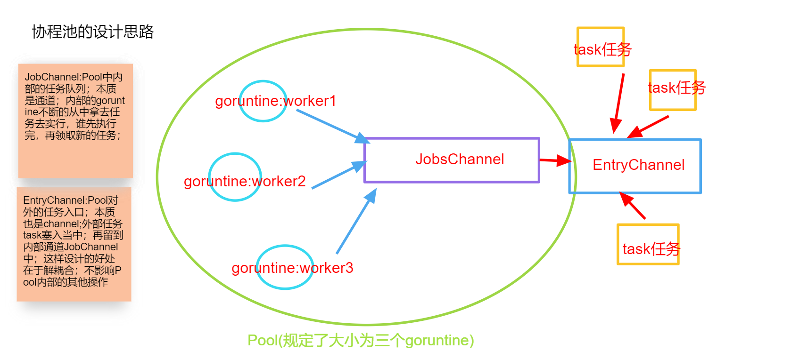
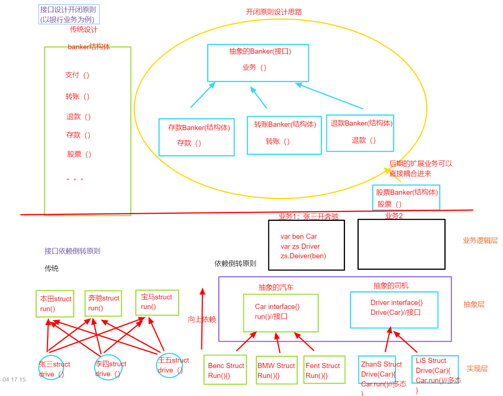

# Go语法基础学习笔记

1. 各种变量声明与赋值、常量与iota、整型、浮点型、布尔值

2. 自定义类型与类型别名

3. fmt总结使用

4. 字符串的操作、修改以及类型转换

5. if判断for循环、switch、goto

6. 运算符：&、|、^、<<、>>、+、-、*、%、/

7. 数组与切边

8. append与copy

9. 指针类型与指针地址

10. make与new的使用和区别

11. map

12. 回文判断demo

13. 函数类型与定义、作用域

14. 结构体struct{}{}、method；

15. 结构体与json(序列化与反序列化)

16. 值接收与指针接收

17. 函数版学生管理系统demo和结构体版学生管理系统demo

18. 接口（interface{}）定义与实现

19. 包(package)

20. 文件操作（读、写、追加、删除、新增、修改）

21. time包的使用

22. 不同等级日志库统一处理；分控制台和生成文件

23. ini配置文件解析

24. strconv包的使用

25. 并发协程goroutine 、等待组sync.WaitGroup、sync.Map、sync.Once

26. 通道channel、互斥锁与读写锁

27. Context包使用

28. TCP 服务端与客户端开发、UDP服务端与客户端开发、http服务端与客户端开发

29. 单员测试、测试覆盖率、基准测试、性能比较测试

30. flag包使用

31. pprof性能调优

32. go连接数据库以及基本操作

33. go连接redis以及基本操作

34. go module 版本控制使用

35. 协程池的设计思路与demo

    

36. 接口设计的开闭原则和依赖倒转原则及demo

    

    